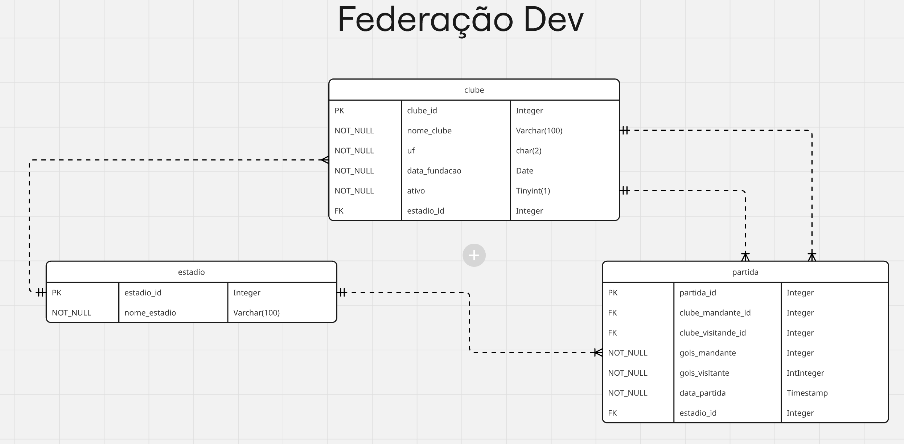

# Federação DEV

---
## Sobre

A **Federação DEV** é um projeto de API RESTful para gerenciar partidas de futebol, clubes e estádios. O objetivo é fornecer uma interface simples e eficiente para manipulação de dados relacionados ao futebol, com foco em praticidade e escalabilidade.

---

### Projeto gerenciado no JIRA - Solicite acesso ao autor.

---

## Checklist de Requisitos – API de Partidas de Futebol

### Requisitos não-funcionais

- [x] Utilizar Java 21 com Spring Boot e Spring Data.
- [x] Código hospedado no GitHub.

---

### Requisitos funcionais mínimos

- [x] **Cadastrar um clube** (`POST` – 201 CREATED)
- [x] **Editar um clube** (`PUT` – 200 OK)
- [x] **Inativar um clube** (`DELETE` – 204 NO CONTENT)
- [x] **Buscar um clube pelo ID** (`GET` – 200 OK)
- [x] **Listar clubes** c/ filtros, paginação e ordenação (`GET` – 200 OK)
- [x] **Cadastrar uma partida** (`POST` – 201 CREATED)
- [x] **Editar uma partida** (`PUT` – 200 OK)
- [x] **Remover uma partida** (`DELETE` – 204 NO CONTENT)
- [x] **Buscar uma partida pelo ID** (`GET` – 200 OK)
- [x] **Listar partidas** c/ filtros, paginação e ordenação (`GET` – 200 OK)

#### OPCIONAL Estádios
- [x] **Cadastrar um estádio** (`POST` – 201 CREATED)
- [x] **Editar um estádio** (`PUT` – 200 OK)
- [x] **Buscar um estádio pelo ID** (`GET` – 200 OK)
- [x] **Listar estádios** c/ paginação e ordenação (`GET` – 200 OK)

---

### Buscas avançadas

- [ ] Retrospecto geral de um clube (`GET` – 200 OK)
- [ ] Retrospecto de um clube contra adversários (`GET` – 200 OK)
- [ ] Confrontos diretos entre dois clubes (`GET` – 200 OK)
- [ ] Ranking dos clubes (Jogos, Vitórias, Gols, Pontos) (`GET` – 200 OK)

---

### Filtros avançados

- [ ] Filtrar partidas por goleadas (diferença ≥ 3 gols)
- [ ] Filtrar por mandantes e visitantes nas consultas de clubes/partidas

---

### Outros Requisitos & Boas Práticas

- [ ] **Criar testes unitários e de integração para as operações de Partida.**
- [ ] **Criar testes unitários e de integração para as operações de Clube.**
- [ ] **Criar testes unitários e de integração para as operações de Estádio.**
- [x] **Bean Validation.**
- [x] **Refinar documentação da API com Swagger/OpenAPI.**
- [x] **Criar README.md completo no GitHub com instruções de instalação e uso.**
- [ ] **Consultas com filtros, paginação, ordenação conforme necessário.**
- [x] **Implementar tratamento de erros e exceções.**
- [x] **Utilização de DTOs e mapeamento (MapStruct/ModelMapper).**

---

### Incrementais

- [x] Customização de Exceções com uso de Record e ENUM
- [x] Utilização de Metodologia Ágil SCRUM para desenvolvimento do projeto
- [x] Otimização de performance

---

## Banco de dados SQL

Criação do banco de dados
```sql
CREATE DATABASE federacao;
USE federacao;

CREATE TABLE estadio (
estadio_id INT PRIMARY KEY AUTO_INCREMENT,
nome_estadio VARCHAR(100) NOT NULL
);

CREATE TABLE clube (
clube_id INT PRIMARY KEY AUTO_INCREMENT,
nome_clube VARCHAR(100) NOT NULL,
uf_clube CHAR(2) NOT NULL,
data_fundacao DATE NOT NULL,
ativo BOOLEAN NOT NULL,
estadio_id INT NOT NULL,
FOREIGN KEY (estadio_id) REFERENCES estadio(estadio_id)
);

CREATE TABLE partida (
partida_id INT PRIMARY KEY AUTO_INCREMENT,
clube_mandante_id INT NOT NULL,
clube_visitante_id INT NOT NULL,
gols_mandante INT NOT NULL,
gols_visitante INT NOT NULL,
data_da_partida TIMESTAMP NOT NULL,
estadio_id INT NOT NULL,
FOREIGN KEY (clube_mandante_id) REFERENCES clube(clube_id),
FOREIGN KEY (clube_visitante_id) REFERENCES clube(clube_id),
FOREIGN KEY (estadio_id) REFERENCES estadio(estadio_id)
);

```
---

## DER – Diagrama Entirdade Relacionamento



---

## 🛠️ Requisitos de Instalação

Antes de iniciar, instale/configure os seguintes pré-requisitos no seu ambiente:

- [Java 21 (JDK)](https://adoptium.net/pt/temurin/releases/?version=21) instalado
- [Maven 3.8+](https://maven.apache.org/download.cgi) instalado
- [MySQL 8+](https://dev.mysql.com/downloads/) instalado e rodando
- [Git](https://git-scm.com/)
- *(Opcional)* [MySQL Workbench](https://dev.mysql.com/downloads/workbench/) para administração do banco de dados

---

## Instalação do Projeto

### 1. Clonar o repositório

```sh
git clone https://github.com/andreknapik/desafio_tc_federacao_dev.git
cd desafio_tc_federacao_dev
```

### 2. Configurar o banco de dados
Crie um banco de dados MySQL chamado `federacao` e execute o script SQL fornecido acima para criar as tabelas necessárias.
### 3. Configurar as credenciais do banco de dados
Edite o arquivo `src/main/resources/application.properties` com as credenciais do seu banco de dados:

```properties
spring.datasource.url=jdbc:mysql://localhost:3306/federacao
spring.datasource.username=seu_usuario
spring.datasource.password=sua_senha
spring.jpa.hibernate.ddl-auto=update
spring.jpa.show-sql=true
```
### 4. Compilar o projeto
```sh
mvn clean install
```
### 5. Executar a aplicação
```sh
mvn spring-boot:run
```
### 6. Acessar a API
A API estará disponível em `http://localhost:8080/api/v1`. Você pode usar ferramentas como Postman ou Insomnia para testar os endpoints.
### 7. Documentação da API
A documentação da API está disponível em `http://localhost:8080/swagger-ui/index.html` após iniciar a aplicação. Utilize o Swagger para explorar os endpoints e testar as operações.
